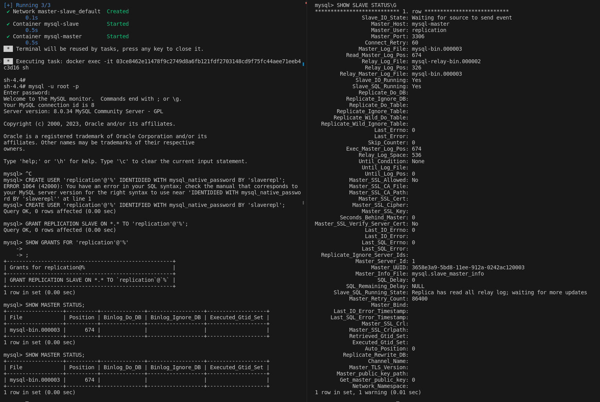

# Домашнее задание к занятию «Репликация и масштабирование. Часть 1» "Макарцев Александр Владимирович"

### Задание 1

На лекции рассматривались режимы репликации master-slave, master-master, опишите их различия.

*Ответить в свободной форме.*

#### Решение

- master-slave: Все изменения производятся на master, после этого они реплицируются на slave. Чтение происходит и master, и с slave.
- master-master: Каждый сервер одновременно является и master, и slave. Изменения можно вносить на оба master`a, после этого они реплицируются на другой сервер. Есть значительная вероятность потерять данные.

---

### Задание 2

Выполните конфигурацию master-slave репликации, примером можно пользоваться из лекции.

*Приложите скриншоты конфигурации, выполнения работы: состояния и режимы работы серверов.*

#### Решение

---

## Дополнительные задания (со звёздочкой*)
Эти задания дополнительные, то есть не обязательные к выполнению, и никак не повлияют на получение вами зачёта по этому домашнему заданию. Вы можете их выполнить, если хотите глубже шире разобраться в материале.

---

### Задание 3* 

Выполните конфигурацию master-master репликации. Произведите проверку.

*Приложите скриншоты конфигурации, выполнения работы: состояния и режимы работы серверов.*
